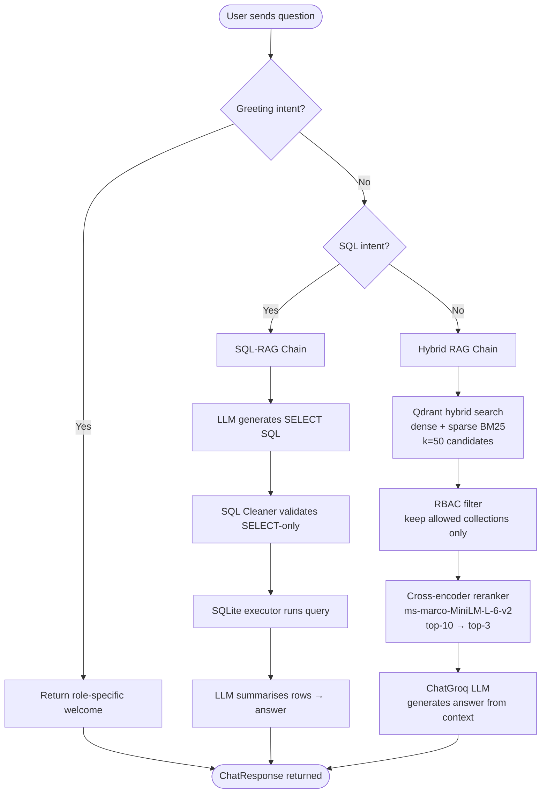
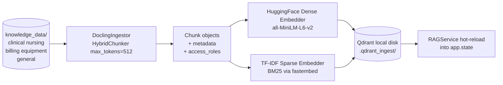
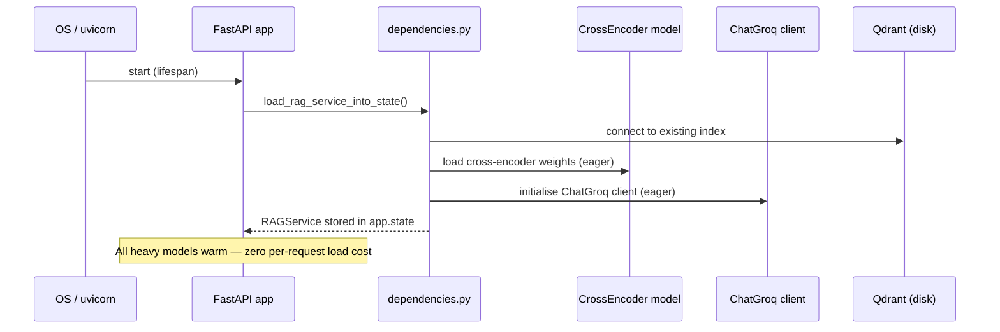

# MediBot — Enterprise Medical AI Assistant

MediBot is a **Role-Based Access Control (RBAC) RAG chatbot** for Healthcare Network staff. It answers queries about clinical protocols, nursing procedures, billing workflows, and equipment manuals — enforcing data access boundaries per user role at every layer of the retrieval pipeline.

---

## Table of Contents

1. [Architecture Overview](#architecture-overview)
2. [Application Workflow](#application-workflow)
3. [Project Structure](#project-structure)
4. [Prerequisites](#prerequisites)
5. [Environment Setup](#environment-setup)
6. [Running the Application](#running-the-application)
7. [Knowledge Base & Indexing](#knowledge-base--indexing)
8. [Demo Users & RBAC](#demo-users--rbac)
9. [API Reference](#api-reference)
10. [Running Tests](#running-tests)
11. [Key Dependencies & Version Constraints](#key-dependencies--version-constraints)

---

## Architecture Overview

```
┌─────────────────────────────────────────────────────────┐
│                    Next.js Frontend                      │
│  Login → Chat UI → Response Details + Source Citations  │
└──────────────────────┬──────────────────────────────────┘
                       │ HTTP  /api/v1
┌──────────────────────▼──────────────────────────────────┐
│                  FastAPI Backend                         │
│                                                         │
│  ┌──────────┐   ┌────────────┐   ┌──────────────────┐  │
│  │  Auth /  │   │  RAG       │   │  Admin           │  │
│  │  Login   │   │  Service   │   │  (build/status)  │  │
│  └──────────┘   └─────┬──────┘   └──────────────────┘  │
│                       │                                 │
│        ┌──────────────┼──────────────┐                  │
│        ▼              ▼              ▼                  │
│  ┌──────────┐  ┌────────────┐  ┌──────────────┐        │
│  │ Greeting │  │ SQL-RAG    │  │ Hybrid RAG   │        │
│  │ Handler  │  │ (SQLite)   │  │ (Qdrant)     │        │
│  └──────────┘  └────────────┘  └──────┬───────┘        │
│                                       │                 │
│                          ┌────────────▼──────────────┐  │
│                          │  Ingestion Phase           │  │
│                          │  Docling → HybridChunker  │  │
│                          │  → Dense + Sparse Embed   │  │
│                          │  → Qdrant (local disk)    │  │
│                          └───────────────────────────┘  │
└─────────────────────────────────────────────────────────┘
```

---

## Application Workflow

### Request Routing



### Indexing / Build Workflow



### Startup Sequence



---

## Project Structure

```
MediBot/
├── backend/
│   ├── app/
│   │   ├── api/v1/
│   │   │   └── endpoints/
│   │   │       ├── admin.py       # POST /rag/build, GET /rag/status
│   │   │       ├── chat.py        # POST /chat
│   │   │       ├── collections.py # GET /collections/{role}
│   │   │       ├── health.py      # GET /health
│   │   │       └── login.py       # POST /login
│   │   ├── auth/
│   │   │   ├── demo_users.py      # username → role mapping
│   │   │   ├── roles.py           # UserRole enum, ROLE_COLLECTIONS
│   │   │   └── security.py        # JWT token issue/verify
│   │   ├── core/
│   │   │   ├── config.py          # Settings (pydantic-settings, .env)
│   │   │   └── index_status.py    # ready-flag helpers
│   │   ├── generation/
│   │   │   ├── chains/
│   │   │   │   ├── sql_cleaner.py # SELECT-only SQL sanitiser
│   │   │   │   ├── sql_rag.py     # SQL generation + execution chain
│   │   │   │   └── sqlite_executor.py
│   │   │   ├── langchain_hybrid_chain.py  # LangChain QA chain (pre-loaded)
│   │   │   ├── llm_client.py      # GroqLLMClient
│   │   │   └── rag_service.py     # Orchestrator: routing + answer assembly
│   │   ├── ingestion/
│   │   │   ├── docling_ingestor.py  # PDF/MD → Chunk via HybridChunker
│   │   │   ├── prepare_pipeline.py
│   │   │   └── vector_store.py    # VectorStoreClient (Qdrant wrapper)
│   │   ├── models/                # Pydantic models (chunk, auth, chat, user)
│   │   ├── retrieval/
│   │   │   ├── embeddings/        # HuggingFace dense + TF-IDF sparse
│   │   │   ├── rerankers/         # CrossEncoder (eager-loaded at startup)
│   │   │   └── retrievers/        # InMemoryHybridRetriever
│   │   ├── dependencies.py        # FastAPI DI wiring, RAGService assembly
│   │   └── main.py                # App factory + lifespan
│   ├── knowledge_data/           # Knowledge base documents
│   │   ├── billing/
│   │   ├── clinical/
│   │   ├── equipment/
│   │   ├── general/
│   │   ├── nursing/
│   │   └── db/                    # MediBot.db (SQLite)
│   ├── tests/                     # pytest test suite
│   └── requirements.txt
└── frontend/
    ├── app/
    │   ├── globals.css
    │   └── layout.tsx / page.tsx
    ├── components/
    │   └── ChatBox.tsx            # Main chat + login UI
    ├── lib/
    │   └── api.ts                 # Typed fetch wrappers
    └── package.json
```

---

## Prerequisites

| Requirement | Version |
|---|---|
| Python | 3.11+ |
| Node.js | 18+ |
| npm | 9+ |

> **Important:** `docling==2.40.0` must be used exactly. Upgrading to 2.107+ breaks the `HybridChunker` import path. See [Key Dependencies](#key-dependencies--version-constraints).

---

## Environment Setup

### 1. Backend — `.env` file

Create `backend/.env` (copied from the table below):

```env
# Required
GROQ_API_KEY=gsk_...your_groq_api_key...

# Optional overrides (defaults shown)
APP_NAME=MediBot API
APP_ENV=development
APP_PORT=8000
AUTH_SECRET=change-this-in-production

GROQ_MODEL=openai/gpt-oss-20b
GROQ_TEMPERATURE=0.1

# Paths — defaults resolve relative to the backend/ folder
KNOWLEDGE_BASE_PATH=   # defaults to backend/knowledge_data/
QDRANT_PATH=           # defaults to backend/.qdrant_ingest/
SQLITE_DB_PATH=        # defaults to backend/knowledge_data/db/MediBot.db

# CORS — comma-separated or JSON array
ALLOWED_ORIGINS=http://localhost:3000,http://localhost:3001
```

Get a free Groq API key at <https://console.groq.com>.

### 2. Frontend — `.env.local` file (optional)

```env
NEXT_PUBLIC_API_BASE_URL=http://localhost:8000/api/v1
```

The frontend defaults to `http://localhost:8000/api/v1` if this is unset.

---

## Running the Application

### Backend

```bash
# From the repo root
cd backend
pip install -r requirements.txt
uvicorn app.main:app --reload
```

The API will be available at `http://localhost:8000`.  
Interactive docs: `http://localhost:8000/docs`

### Frontend

```bash
# From the repo root
cd frontend
npm install
npm run dev
```

The UI will be available at `http://localhost:3000`.

---

## Knowledge Base & Indexing

### Document Layout

Place source documents under `backend/knowledge_data/` in the appropriate collection sub-folder:

| Folder | Collection name | Accessible by |
|---|---|---|
| `clinical/` | `clinical` | doctor, admin |
| `nursing/` | `nursing` | doctor, nurse, admin |
| `billing/` | `billing` | billing_executive, admin |
| `equipment/` | `equipment` | technician, admin |
| `general/` | `general` | all roles |

Supported file types: **`.pdf`** and **`.md`**.

### Building the Index

The index must be built before the chat endpoint will respond. There are two ways:

#### Option A — Admin UI (recommended)

1. Log in as `admin.sys` in the frontend.
2. In the left sidebar under **Index Management**, click **Re-index**.
3. The sidebar polls every 3 seconds and shows **"Re-indexing complete."** when done.

#### Option B — API call

```bash
# Obtain a token first
TOKEN=$(curl -s -X POST http://localhost:8000/api/v1/login \
  -H "Content-Type: application/json" \
  -d '{"username":"admin.sys"}' | python -c "import sys,json; print(json.load(sys.stdin)['token'])")

# Trigger build
curl -X POST http://localhost:8000/api/v1/admin/rag/build \
  -H "Authorization: Bearer $TOKEN"

# Poll status
curl http://localhost:8000/api/v1/admin/rag/status \
  -H "Authorization: Bearer $TOKEN"
```

The build runs in the background. The existing service continues to answer requests until the new index is ready and hot-reloaded.

---

## Demo Users & RBAC

| Username | Role | Collections |
|---|---|---|
| `dr.mehta` | doctor | clinical, nursing, general |
| `nurse.priya` | nurse | nursing, general |
| `billing.ravi` | billing_executive | billing, general |
| `tech.anand` | technician | equipment, general |
| `admin.sys` | admin | clinical, nursing, billing, equipment, general |

`billing_executive` and `admin` roles can also trigger **SQL analytics** queries against the SQLite database.

Authentication uses short-lived JWT tokens. No password is required — select a username and click **Sign In**.

---

## API Reference

All endpoints are under `/api/v1`. Protected endpoints require `Authorization: Bearer <token>`.

| Method | Path | Auth | Description |
|---|---|---|---|
| `POST` | `/login` | — | Returns `token` + `role` |
| `GET` | `/collections/{role}` | ✓ | Lists collections accessible to role |
| `POST` | `/chat` | ✓ | Asks a question; returns answer + sources |
| `GET` | `/health` | — | Liveness check |
| `GET` | `/admin/rag/status` | ✓ admin | Index ready / service loaded / build in progress |
| `POST` | `/admin/rag/build` | ✓ admin | Trigger background re-index |

### `POST /chat` — request / response

```json
// Request
{ "question": "What is the ICU handover protocol?" }

// Response
{
  "answer": "...",
  "sources": [
    {
      "source_document": "icu_nursing_procedures.pdf",
      "section_title": "Handover Protocol",
      "collection": "nursing"
    }
  ],
  "retrieval_type": "langchain_hybrid",
  "role": "nurse"
}
```

`retrieval_type` values: `langchain_hybrid` | `classic_hybrid` | `sql_rag` | `greeting_welcome`

---

## Running Tests

```bash
cd backend
pytest -q
# With coverage
pytest --cov=app --cov-report=term-missing -q
```

Test files are in `backend/tests/` and cover endpoints, RBAC enforcement, SQL cleaning, reranking, and metadata generation.

---

## Key Dependencies & Version Constraints

| Package | Pinned version | Reason |
|---|---|---|
| `docling` | `==2.40.0` | `HybridChunker` lives at `docling.chunking`; v2.107+ moved it and breaks ingestion |
| `docling-parse` | `==4.7.3` | v7.0.0 is incompatible with docling 2.40.0 |
| `langchain` | `==1.3.9` | Aligned with langchain-core 1.4.7 |
| `langchain-classic` | `==1.0.0` | Provides `create_retrieval_chain`, `ContextualCompressionRetriever` |
| `qdrant-client` | `==1.12.2` | Matches langchain-qdrant 0.2.0 API |
| `fastembed` | `==0.4.2` | Required by qdrant-client for sparse BM25 vectors |

> Do **not** run `pip install --upgrade` across the board. Use `pip install -r requirements.txt` exactly.

