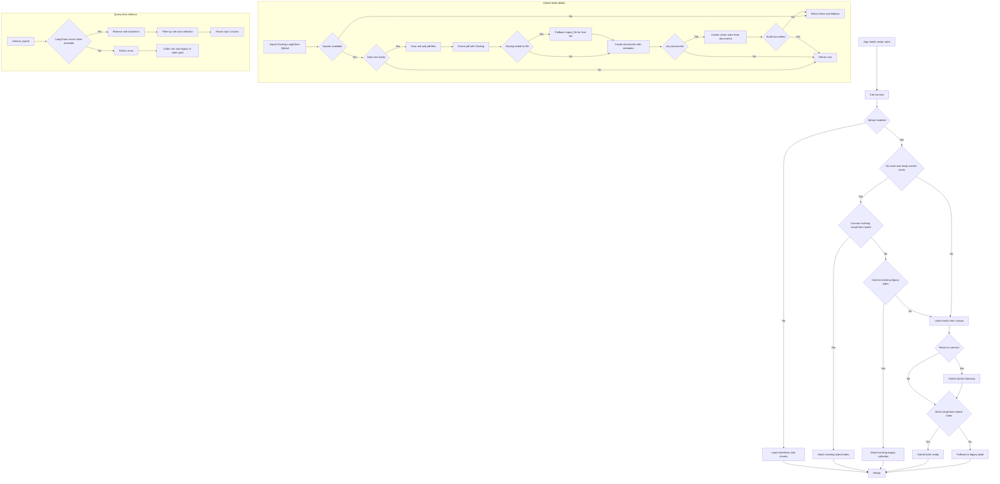

# Architecture Workflow Diagram

```mermaid
flowchart TD
    A["App needs vector store"] --> B["Call connect"]

    B --> C{"Qdrant enabled"}
    C -- No --> C1["Load markdown only chunks"]
    C1 --> Z["Ready"]

    C -- Yes --> D{"No reset and ready marker exists"}
    D -- Yes --> E{"Connect existing LangChain hybrid"}
    E -- Yes --> E1["Attach existing hybrid index"]
    E1 --> Z
    E -- No --> F{"Connect existing legacy index"}
    F -- Yes --> F1["Attach existing legacy collection"]
    F1 --> Z
    F -- No --> G["Load chunks from corpus"]

    D -- No --> G

    G --> H{"Reset on connect"}
    H -- Yes --> H1["Delete Qdrant directory"]
    H -- No --> I
    H1 --> I

    I{"Build LangChain hybrid index"} -- Yes --> I1["Hybrid index ready"]
    I -- No --> J["Fallback to legacy build"]
    I1 --> Z
    J --> Z

    subgraph HybridBuild [Hybrid build details]
      HB1["Import Docling LangChain Qdrant"] --> HB2{"Imports available"}
      HB2 -- No --> HB13["Return false and fallback"]
      HB2 -- Yes --> HB3{"Data root exists"}
      HB3 -- No --> HB12["Return true no docs"]
      HB3 -- Yes --> HB4["Scan md and pdf files"]
      HB4 --> HB5["Chunk pdf with Docling"]
      HB5 --> HB6{"Docling failed for file"}
      HB6 -- Yes --> HB7["Fallback ingest_file for that file"]
      HB6 -- No --> HB8["Create documents with metadata"]
      HB7 --> HB8
      HB8 --> HB9{"Any documents"}
      HB9 -- No --> HB12
      HB9 -- Yes --> HB10["Create vector store from documents"]
      HB10 --> HB11{"Build succeeded"}
      HB11 -- Yes --> HB12["Return true"]
      HB11 -- No --> HB13
    end

    subgraph Retrieval [Query time retrieval]
      R1["retrieve_hybrid"] --> R2{"LangChain vector store available"}
      R2 -- Yes --> R3["Retrieve with boosted k"]
      R3 --> R4["Filter by role and collection"]
      R4 --> R5["Return top k chunks"]
      R2 -- No --> R6["Return none"]
      R6 --> R7["Caller can use legacy or other path"]
    end
```
